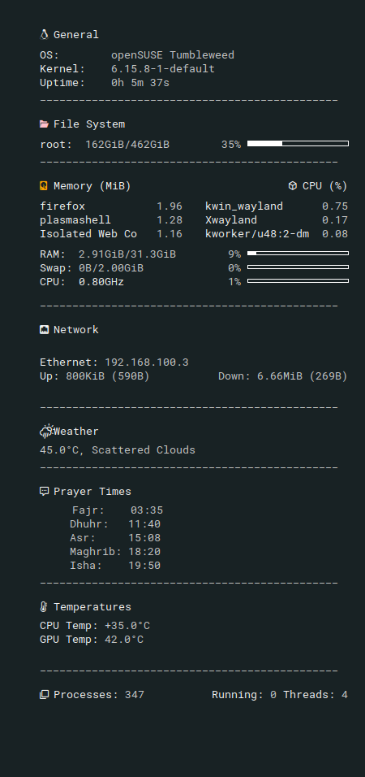
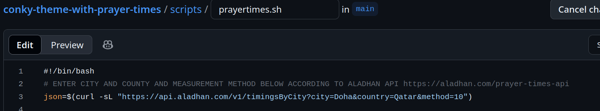
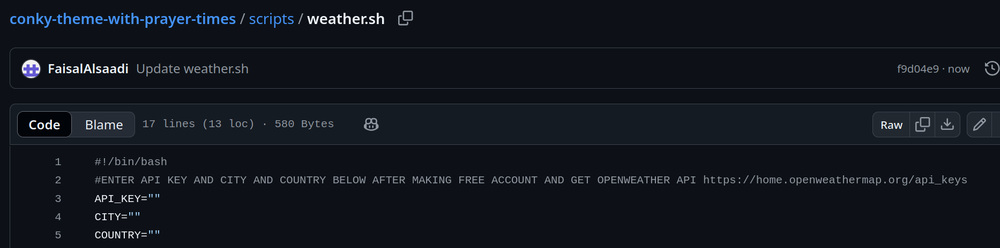

This is a fork of the very nice and clean Slate theme for conky found here https://github.com/CrispyKSP/slate-conky-theme

I Added some sections, such as:
- prayer times (requires editing the prayer.sh script for your own location using the Aladhan API (last section explains in more details))
- weather (requires a Openweather API key to put into the weather.sh script (last section explains in more detail))
- dedicated CPU and GPU temp section

below are the instructions from the original project, with the showcase of the current theme. The section after that explains how to get the API keys for openweather and aladhan to customize the scripts for your location.

=============================================================

a simple conky config!

## install:
#### Debian/Ubuntu: 
`apt install conky`

#### Arch: 
`pacman -S conky`

#### Fedora: 
`dnf install conky` 


#### Setup
```shell
$ mkdir ~/.config/conky
$ mkdir ~/.fonts
$ cd ~/.config/conky
$ git clone https://github.com/TheDucky/slate-conky-theme.git
$ cp fonts/Roboto\ Mono\ Nerd\ Font\ Complete.ttf ~/.fonts
$ conky -c ~/.config/conky/slate-conky-theme/slate-conky.conf
``` 

#### Set conky as a startup application (automatically start on boot)
- create a new file `slate-conky.desktop` in `~/.config/autostart/`

```desktop
[Desktop Entry]
Exec=conky -c /home/$USER/config/conky/slate-conky-theme/slate-conky.conf
Name=slate-conky
Type=Application
```


===================================================================

Aladhan and Openweather API keys:


For prayer times, edit the prayer.sh script and change the second line to your country, city and measurement method. 

For more details about the measurement methods and their codes, please consult the Aladhan website here https://aladhan.com/calculation-methods)

For weather, you need to make a free account at https://openweather.org and get your api key here https://home.openweathermap.org/api_keys and paste it into the weather.sh script, along with your city and country.


